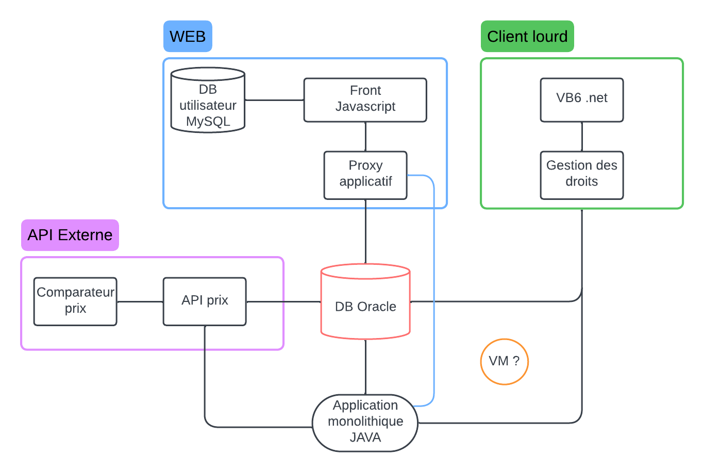

# Analyse de l'existant

## Schéma de l'architecture 

*Schéma de l'architecture existante*

## Qu'est-ce qui est fait ?
### La Base de données
- un serveur Oracle dont la documentation est incomplète,
- Logique métier en PL/SQL (extension procédurale d'Oracle Corporation pour SQL et la base de données relationnelle Oracle),
- Des problèmes de performances sont présent (au niveau de la DB),
- La DB est composé de nombreuses tables de plus de 150 colonnes. La DB est donc d'une taille conséquente.
### Le Frontend
- Codé en JS,
### Le Backend
- Codé en JAVA,
- Composé de plusieurs "briques logicielles" *(Micro Service ?)*,
- Pas d'API,
### Code Source (Font, Back, ...)
- Code Source incomplet,
- Pas de versionning des données (gestion des versions individuelle pour chaque développeur),
- Le rôle d'une VM est inconnu.
### Architecture
- Monolithique
### Tâche principale des développeurs actuels
Maintenance corrective qui implique de nombreuses régressions.

## Les problématiques causées par le système actuel
- Manque de cohérence de l'application,
- Plus de nouveau développement *(ou peu)*,
- Technologie vieillissante ? *(dette technique)*,
- Code avec des normes obsolètes ?,
- Gestion des données compliquée,
- Dépendance de l'architecture des données ?,
- Dépendance du système actuelle *(pas de marge de manoeuvre pour des modifications ?)*,
- Architecture et communication des "briques logicielles" compliquées,
- Documentation incomplète menant à des problèmes de compréhensions des logiques du code ?

## Risque potentiel causés par le système actuel
| Risque | Description | Criticité |
|--------|-------------|-----------|
|Maintenance corrective impossible|La documentation et le code source étants incomplet, la maintenance pourrait s'avérer difficile pour certaines parties de l'application ou des briques logicielles| Haute |
|Perte de modification du code|Puisqu'aucun versionning du code n'est présent, chaque développeur doit gérer le versionning individuellement. Les modifications apportées par un second développeurs pourrait alors être supprimés, sans possibilité de consulter l'historique.| Haute |