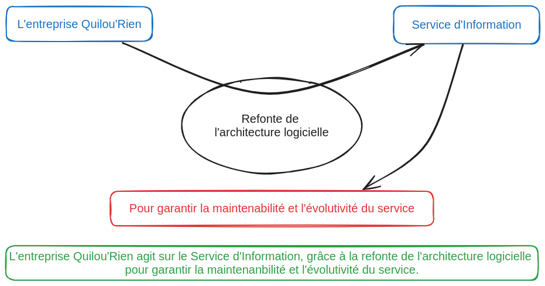

# Analyse du besoin

*Diagramme d'analyse fonctionnelle du besoin*

La refonte de l'architecture doit répondre à la problématique première de l'entreprise vis-à-vis de l'application :
> Comment Garantir la maintenabilité et l'évolutivité du service proposé ?

La résolution de cette problématique peut être envisagée par un hébergement Cloud, même si d'autres solutions ne sont pas à négliger.

# Exigences
La refonte d'architecture logicielle est un projet d'envergure qui vise à repenser et à reconstruire l'infrastructure logicielle d'une application ou d'un système existant. Cette initiative est généralement motivée par des exigences spécifiques. En voici la liste :
- non-régression des fonctionnalités actuelles
- disponibilité de l'infrastructure
- Continuité des données entre les deux architectures
- Documentation exhaustive

# Périmètre de la demande
Le projet comprend les éléments suivants :
- Audit du SI en place,
- Concevoir et justifier  une architecture logicielle,
- Conseiller les décideurs sur la stratégie de développement (budget, organisation du développement, bonnes pratiques, versionning git...),
- Support de la nouvelle architecture.

Cependant, les élements suivant ne seront pas compris dans le projet :
- Développement des applications,
- Mise à disposition du matériel (serveur, ...)