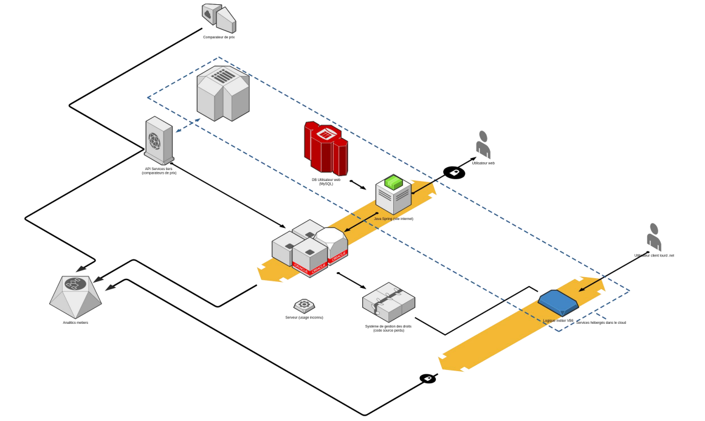

# Consigne
Document de consigne

## Enoncé
### L'avenir de cette entreprise dépend de vous
Vous dirigez le SI d’une PME française de location d’outils, proposant également son logiciel en marque blanche à plusieurs partenaires dont des chaînes d’hypermarchés. L’architecture actuelle date d’une quinzaine d’années et est basée sur Java, une DB Oracle, le tout hébergé en interne. La direction souhaite moderniser son système, incluant l'étude d'un hébergement de type "cloud", et le faire développer par les 5 développeurs présents en interne.

### Description technique de l'architecture
Le serveur Oracle a été déployé en même temps que l’infrastructure, et sa documentation n’est pas forcément à jour. Une grande partie de la logique métier est en PL/SQL, auquel aucun collaborateur n’est formé. Pour pallier aux problèmes de performance, la DB a été déployée sur les plus gros serveurs disponibles, occasionnant de nombreux surcoûts en licences. De nombreuses tables ont plus de 150 colonnes, témoignage des 15 années de “maintenance” effectuée bien souvent en absence de cohérence. La partie front passe par un proxy applicatif, et est écrit en JS (front et proxy).

L’application principale est un monolithe, écrit principalement en Java et maintenue par un des développeurs “historiques”. Plusieurs autres briques logicielles y sont rattachées, connectées directement à la DB en l’absence d’API. Le code source d’une des applications client a été perdu, et ne reste que le binaire compilé en VB6. La “documentation” est un ensemble de documents non exhaustifs, plus ou moins à jour.

Le code source n’est pas versionné et est présent sur un FTP commun, et chaque développeur gère ses versions internes. La majorité du temps passé par les développeurs est sur de la maintenance corrective, et implique de nombreuses régressions, mal vécues par les utilisateurs.

Une VM tourne sans que personne ne sache exactement quel est son rôle.

Une partie des informations étant manquantes (cf schéma), vous devrez expliciter comment vous réaliserez l'analyse de ces parties. Vous choisirez ensuite le type d'usage des machines non documentées. L'architecture actuelle présente plusieurs manque que vous documenterez.

## Travail demandé / Livrable final
Vous devrez tout d’abord réaliser un rapport sur l’existant, ses problématiques et les risques associés pour l’entreprise. Vous devez ensuite proposer une refonte de l’infrastructure, prenant en compte les points énoncés ci-dessus. L’architecture proposée devra être détaillée, au niveau logiciel, matériel et humain. Enfin, vous devrez concevoir un plan budgétaire de la refonte, ainsi qu’un calendrier de réalisation.

Vous présenterez votre solution d’architecture et les choix technologiques argumentés lors d’une soutenance de 20 min qui sera suivie d’un échange de 15 minutes avec le jury.

## Déroulement et livrables intermédiaires

| jour | Etapes |
|------|--------|
|  1   | Formation des groupes, définitions des méthodes et outils utilisés, prise en main du sujet |
|  2   | Approfondissement de la compréhension du sujet, début de la veille |
|  3   | Travail de veille pour comparer les différents choix possibles d’architecture |
|  4   | Définition de l’architecture globale, création du schéma, création de l’argumentaire étayé de choix basé sur des critères factuels |
|  5   | Définition des technologies, création de l’argumentaire étayé de choix basé sur des critères factuels |
|  6   | Préparation du support et de la soutenance |

## Organisation
Le jury est composé du pilote et/ou d'un intervenant expert